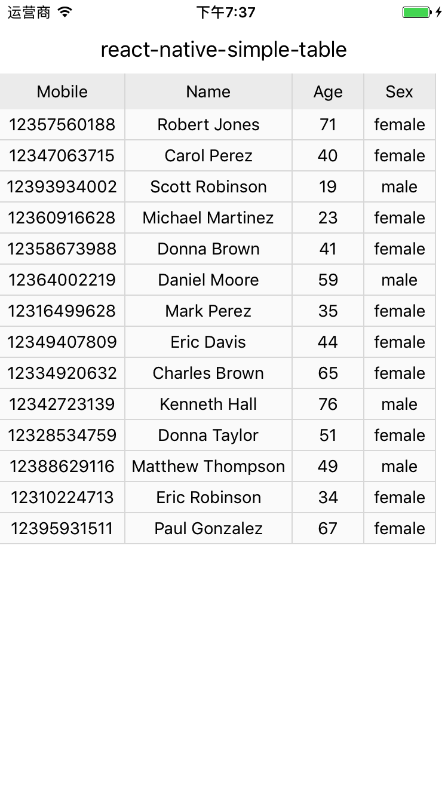

# react-native-simple-table
A simple table for react native.



# Installation
`npm install react-native-simple-table --save`

# Usage
```js
import React, { Component } from 'react'
import {
  Platform,
  StyleSheet,
  View,
  Text
} from 'react-native'
import Table from 'react-native-simple-table'

import DataFactory from '../mock/DataFactory'

const columns = [
  {
    title: 'Mobile',
    dataIndex: 'mobile',
    width: 105
  },
  {
    title: 'Name',
    dataIndex: 'name',
    width: 140
  },
  {
    title: 'Age',
    dataIndex: 'age'
  },
  {
    title: 'Sex',
    dataIndex: 'sex'
  },
];

class Example extends Component {
  render() {
    let dataSource = DataFactory.generate().data;
    return (
      <View style={styles.container}>
        <Text style={styles.title}>react-native-simple-table</Text>
        <Table height={320} columnWidth={60} columns={columns} dataSource={dataSource} />
      </View>
    )
  }
}

const styles = StyleSheet.create({
  container: {
    ...Platform.select({
      ios: {
        paddingTop: 20
      },
      android: {}
    }),
  },
  title: {
    fontSize: 18,
    padding: 10,
    textAlign: 'center'
  }
});

export default Example
```

```js
import mockjs, { Random } from 'mockjs'

export default class DataFactory {
  static generate() {
    return mockjs.mock({
      'data|1-20': [{
        'mobile|12300000000-12399999999': 1,
        'name|1': '@first @last',
        'age|18-80': 1,
        'sex|1': () => Random.pick(['male','female']),
      }]
    });
  }
}
```


# API
Table

| Property | Description | Type | Default |
---|---|---|---
dataSource | data record array to be rendered | any[] | []
columns | columns of table | Column[] | []
columnWidth | column width | number | 60
renderCell | render function | function | undefined
height | table height | number | 240

Column

| Property | Description | Type | Default |
---|---|---|---
title | title of this column | string | -
dataIndex | display field of the data record | string | -
width | width of this column | number | -
